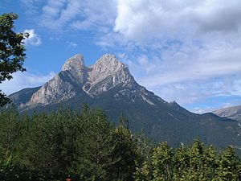

#Pedraforca

El Pedraforca és una emblemàtica muntanya de Catalunya, situada entre els termes municipals de Saldes i Gósol, al Berguedà. Té una forma molt peculiar, formada per dues carenes paral·leles unides per un coll.

## Situació
Municipi de [Saldes](http://www.saldes.cat)
## Característiques
El Pollegó Superior té una altitud de 2.506,4 metres (amb un cim secundari, el Calderer de 2.496,7 metres) i el Pollegó Inferior de 2444,8 m. L'Enforcadura se situa a 2.356,2 m i té una tartera a cada banda
